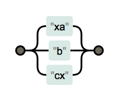
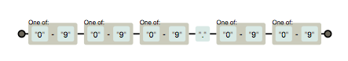
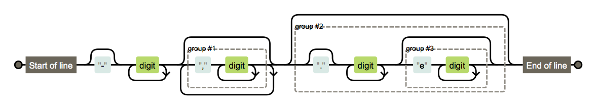

```{r, include=FALSE}
library(re2r)
library(stringi)
knitr::opts_chunk$set(comment = "#>")
```

# Learn Regular Expression with re2r

Regular expression helps you detect a pattern in a string. It also can help you extract or replace substrings in a string.

This tutorial introduces the syntax of RE2 regular expression.

You can also learn the tutorial with swirl in R. Run this line in R to start in swirl:

```r
source("https://raw.githubusercontent.com/qinwf/re2r_doc/master/re2r_swirl.r")
```

We will learn some basic syntax first, and then we will learn more about the regex methods.

For the syntax parts, There are 6 sections.

## Normal Letters and Digits

Let's write our first regular expression (regex) to match "hello world".

```{r}
re2_detect(string = "hello world", pattern = "hello world")
```

`re2_detect` test a pattern in strings, and return boolean. The pattern "hello world" just matches the string "hello world", so the result is `TRUE`.

For the pattern, it contains just simple English characters, which are normal characters and represent themselves in the pattern. "one" will match "one", "911" will match "911".

If you want to test whether a string contains "happy", you can use the pattern "happy".

```{r}
re2_detect(string = c("I am happy", "I am sad"), pattern = "happy")
```

## Composition

### Simple Composition

Combine normal characters and metacharacters, we can create many very complicated regexes.

The simplest way to do, is to write them together, and we write this kind of patterns before.

```{r}
re2_detect("hello ", "hello ")
```

### Alternative `|`

Metacharacters and metasequences are characters or sequences of characters that have special meanings in regexes. eg, `|` does not represent itself in a pattern.

`x|y` means `match x or y, and prefer x`.

```{r}
re2_detect("abc", "abd|c")
```

What about pattern `xa|b|cx` ?

For a long regex, it will be really hard to read and understand. `show_regex` will help you to visualize it. `show_regex` now supports Javascript style regex syntax, and it covers most of RE2 syntax.

Use `show_regex` to show the result:

```r
show_regex("xa|b|cx")
```



```{r}
re2_detect("b", "xa|b|cx")
```

## Match Single Character

### Matches Any Character except a Newline `.`

Matches any character except a newline. 

```{r}
re2_detect(string = c("one","o e"), pattern = "o.e")
```

### Character Classes `[...]` & `[^...]`

Character classes `[...]` allow you to list the characters that you want to match. A character class always matches one character.

This pattern deals with "calendar" with misspellings.

```{r}
re2_detect(c("calendar", "celendar"), "c[ae]l[ae]nd[ae]r")
```

Negated character classes `[^...]` allow you to list the characters that you do not want to match, and match the rest characters. It also only matches one character

```{r}
re2_detect(c(" ", "b"), "[^a-zA-Z0-9]")
```

The - (dash) indicates a range of characters. For example, `[a-z]` matches any lowercase ASCII letter. To include the dash in the list of characters, either list it first, or escape it.

" " is not in the range of `[a-zA-Z0-9]`, so it matches `[^a-zA-Z0-9]`. "b" is in `[a-z]`, so `[^a-zA-Z0-9]` does not match "b".

### Escape Metacharacters `\` 

`\` can help you escape metacharacters, and let them represent themselves. In R code, "\\\\" will represent \\ in a string. 

```{r}
cat("\\")
cat("\\.")
```

So you can usually see we use "\\\\" in R code to escape a character.

```{r}
re2_detect(string = ".", pattern = "\\.")
re2_detect(string = "\\", pattern = "\\\\")
```

There are some more [escape sequences](http://qinwenfeng.com/re2r_doc/re2r-syntax.html#escape_sequences).

### `\s \S \d \D \w \W`

Combine `\` with a normal character, eg. `\s`, will change the meanings of normal character. `\s` represents a whitespace character.

```{r}
cat("\\s")
re2_detect(string = " ", pattern = "\\s")
```

`\S` title case with `S` matches not whitespace.

```{r}
re2_detect(string = "abc", pattern = "\\S")
re2_detect(string = " ", pattern = "\\S")
```

`\w` is word characters, and is the same as `[0-9A-Za-z_]`.

```{r}
re2_detect(string = "abc_", pattern = "\\w\\w\\w\\w")
```

`\W` is not word characters, and is the same as `[^0-9A-Za-z_]`.

```{r}
re2_detect(" ^%#@", "\\W\\W\\W\\W\\W")
```

`\d` represents a digit `[0-9]`, `\D` a character that is not a digit `[^0-9]`.

```{r}
re2_detect("100.11", "\\d\\d\\d\\.\\d\\d")
re2_detect("100.11", "[0-9][0-9][0-9]\\.[0-9][0-9]")
```

```r
show_regex("[0-9][0-9][0-9]\\.[0-9][0-9]")
```



### ASCII Character Classes

There are some more character classes for ASCII character, eg. `[[:alpha:]]` represent `[A-Za-z]`, `[[:lower:]]` represent `[a-z]`. Check out the whole list here [ASCII character classes](http://qinwenfeng.com/re2r_doc/re2r-syntax.html#ascii_character_classes).

ASCII character classes matches only one character.

```{r}
re2_detect("a","[[:lower:]]")
```

### Unicode Character Class

`\s \S \d \D \w \W` are Perl character classes. 

`[[:xxx:]]` is the style of ASCII character classes, eg. `[[:lower:]]`.

`\p{xxx}` is the style of Unicode character class.

[Unicode character class](http://qinwenfeng.com/re2r_doc/re2r-syntax.html#unicode_character_classes) is the link to the total list of Unicode character classes that are supported by `re2r`.

```{r}
re2_detect(c("ß","¶"), "\\p{L}")
```

`\p{L}` is a Unicode character classes matches Unicode letters.

## Repetition

### `* + ?`

`*` zero or more, prefer more 

```{r}
re2_detect(c("ba", "b", "a", "baa"), "ba*")
re2_match(c("ba", "b", "a", "baa"), "ba*")
```

`re2_match` returns the matched string. If there is no match, `NA` is returned.

`+` one or more x, prefer more 

```{r}
re2_detect(c("ba", "b", "a", "baa"), "ba+")
re2_match(c("ba", "b", "a", "baa"), "ba+")
```

`?` zero or one x, prefer one 

```{r}
re2_detect(c("ba", "b", "a", "baa"), "ba?")
re2_match(c("ba", "b", "a", "baa"), "ba?")
```

### `{n,m} {n,} {n}`

`{n,m}` n to m times, prefer more

```{r}
re2_detect(c("ba", "b", "a", "baa"), "ba{0,2}")
re2_match(c("ba", "b", "a", "baa"), "ba{0,2}")
```

`{n,}` n or more times, prefer more

```{r}
re2_detect(c("ba", "b", "a", "baa"), "ba{1,}")
re2_match(c("ba", "b", "a", "baa"), "ba{1,}")
```

`{n}` exactly n times

```{r}
re2_detect(c("ba", "b", "a", "baa"), "ba{2}")
re2_match(c("ba", "b", "a", "baa"), "ba{2}")
```

### Non-greedy with `?`

`x*?` zero or more x, prefer fewer

```{r}
re2_detect(c("ba", "b", "a", "baa"), "ba*?")
re2_match(c("ba", "b", "a", "baa"), "ba*?")
```

`x+?` one or more x, prefer fewer

```{r}
re2_detect(c("ba", "b", "a", "baa"), "ba+?")
re2_match(c("ba", "b", "a", "baa"), "ba+?")
```

`x??` zero or one x, prefer zero

```{r}
re2_detect(c("ba", "b", "a", "baa"), "ba??")
re2_match(c("ba", "b", "a", "baa"), "ba??")
```

`x{n,m}?` n to m times, prefer fewer

```{r}
re2_detect(c("ba", "b", "a", "baa"), "ba{0,2}?")
re2_match(c("ba", "b", "a", "baa"), "ba{0,2}?")
```

`x{n,}?` n or more times, prefer fewer

```{r}
re2_detect(c("ba", "b", "a", "baa"), "ba{1,}?")
re2_match(c("ba", "b", "a", "baa"), "ba{1,}?")
```

`x{n}?` exactly n time

```{r}
re2_detect(c("ba", "b", "a", "baa"), "ba{2}?")
re2_match(c("ba", "b", "a", "baa"), "ba{2}?")
```

## Group

### Unnamed Group `()`

With groups `()`, we can capture a unit of a substring in a pattern.

```{r}
re2_detect(c("XOXO"), "(XO){2}")
re2_match(c("XOXO"), "(XO){2}")
```

`.1` is the first captured group.

```{r}
re2_match(c("XOXOO"), "(XO+){2}")
```

 `(XO+){2}` iterates on `(XO+)` for two times, and `.1` only returns the last iteration of the result. The first time is "XO", the last times is "XOO". 
 
To get the total result of the `(XO+){2}`, we can wrap another group around it.
 
```{r}
re2_match("XOXOO", "((XO+){2})")
```

### Named Group `(?P<name>)`

Each captured group can have a name. The name can contains ASCII letters and digits.

```{r}
re2_match("test@mail.com", "(?P<username>[a-zA-Z0-9._%-]+)@(?P<host>[a-zA-Z0-9.-]+\\.[a-zA-Z]{2,4})")
```

### Uncaptured Group `(?:)`

The uncaptured group does not capture and return the result, but will group the into a unit.

```{r}
re2_match("The number is 12345.", ".*(?:\\d{5}).*")
re2_match("The number is 12345.", ".*(\\d{5}).*")
```

### Flags with Group `(?ims-U:)`

`i`	case-insensitive

```{r}
re2_detect("HAPPY", "(?i:happy)")
re2_detect("HAPPY", "happy")
```


`m`	multi-line mode: `^` and dollar symbol match begin/end line in addition to begin/end text

```{r}
cat("abc\ndef")
re2_match("abc\ndef", "(?m:^def$)")
re2_match("abc\ndef", "^def$")
```

`s`	let `.` match `\n` 

```{r}
re2_match("abc\n", "(?s:.*)")
re2_match("abc\n", ".*")
```

`U`	ungreedy: swap meaning of `x` and `x?`, `x+` and `x+?`

```{r}
re2_match("aaaa", "(?U:.+?)")
re2_match("aaaa", ".+?")
```

`-` clear one flag

```{r}
re2_detect("HAPPY", "(?iU:(?-i:happy))")
re2_detect("HAPPY", "(?iU:happy)")
```

## Empty Strings

These characters in the pattern will match empty string, or we can say it match a position in a string.

### Anchor `^ $ \z \A`

`^` matches the beginning of a line.

```{r}
re2_match(c("apple","banana"), "^a")
```

`^a` - `^` assert position at the start of the string, `a` matches the character "a" literally.

For "banana", "a" is not in the position at start of the string. So it does not match `^a`.

`$` matches the end of a line.

```{r}
re2_match(c("apple","banana"), "a$")
```

Use `\A` and `\z` to match the start and end of the string, `^` and `$` match the start/end of a line. The main difference is in the multiline mode with `(?m:)` flag.

```{r}
cat("abc\ndef\ng")
re2_match("abc\ndef\ng", re2("(?m:^g$)"))
re2_match("abc\ndef\ng", re2("(?m:\\Ag\\z)"))
```

### Boundary `\b \B`

`\b` at ASCII word boundary

```{r}
re2_match("to be or not to be", "\\bto\\b")
```

`\B` not at ASCII word boundary

```{r}
re2_locate("to be or not to be", "\\Bo\\B")
```

`re2_locate` returns the start and end position of the matched substring.

The "o" in "not" matches the pattern `\Bo\B`.

## Regex Methods

### Detect

Test a pattern in strings, and return boolean.

```{r}
re2_detect("123-234-2222", "\\d\\d\\d-\\d\\d\\d-\\d\\d\\d\\d")
```

This method vectorises over strings and patterns.

```{r}
re2_detect(c("a","b","c"), c("a","b","c"))
re2_detect(c("a"), c("a","b","c"))
```

### Match

`re2_match` finds matched groups from strings. `re2_match_all` finds all of the matched groups instead of the first one.

```{r}
re2_match(c("123 456", "abc"),"\\b[0-9]+\\b")
re2_match_all(c("123 456","abc"),"\\b[0-9]+\\b")
```

The names of the groups will be column names.

```{r}
re2_match("test@mail.com", "(?P<username>[a-zA-Z0-9._%-]+)@([a-zA-Z0-9.-]+\\.[a-zA-Z]{2,4})")
```

### Extract

`re2_extract` finds matched strings from strings. `re2_extract_all` finds all of the matched strings instead of the first one. The matched groups are not returned.

```{r}
re2_extract(c("123 456", "abc"),"\\b[0-9]+\\b")
re2_extract_all(c("123 456","abc"),"\\b[0-9]+\\b")
```

### Count

`re2_count` counts the number of matches in a string.

```{r}
words = c("sunny","beach","happy","really")
re2_count(words, "y")
```

This method vectorises over strings and patterns.

re2_count("This", letters)

### Replace

`re2_replace` replaces matched patterns in a string. `re2_replace_all` replaces all of the matched groups instead of the first one.

```{r}
# Trim white spaces
pattern = "^[\\s]+|[\\s]+$"
re2_replace(c("  abc  "," this is "), pattern, "")
re2_replace_all(c("  abc  "," this is "), pattern, "")

re2_replace_all(c("123-456-7890","abc-def"), "-", "~")
```

Within replacement, backslash-escaped digits (`\1` to `\9`) can be used to insert text matching corresponding parenthesized group from the pattern. `\0` in replacement refers to the entire matching text.

```{r}
# extract and generate text from an email address
replacement = "My email username is '\\1', and the provider is '\\2'."

re2_replace("test@mail.com", "^([a-zA-Z0-9._%-]+)@([a-zA-Z0-9.-]+\\.[a-zA-Z]{2,4})$", replacement)
```

These two methods vectorise over strings, patterns, and replacements.

### Split

`re2_split` splits up a string into pieces and returns a list of character vectors.

```{r}
re2_split(c("to be or not to be", "apple pie"), " ")
```

Optional parameter `n` is te number of pieces to return. Default value is `Inf` for `re2_split`, and it uses all possible split positions.

```{r}
re2_split(c("to be or not to be", "apple pie"), " ", n = 3)
```

`re2_split_fixed` splits up a string into pieces, and returns a  a character matrix with `n` columns. `n` is not optional, and if `n` is greater than the number of pieces, the result will be padded with empty strings.

```{r}
re2_split_fixed(c("to be or not to be", "apple pie"), " ", n = 3)
```

These two methods vectorise over string and pattern.

### Locate

`re2_locate` locates the position of patterns in a string. If the match is of length 0, (e.g. from a special match like $) end will be one character less than the start.

```{r}
fruit <- c("apple", "banana", "pear", "pineapple")
re2_locate(fruit, "$")
re2_locate(fruit, "a")
re2_locate(fruit, c("a", "b", "p", "e"))
```


`re2_locate_all` locates all of the positions and returns a list.

```{r}
re2_locate_all(fruit, "$")
re2_locate_all(fruit, "e")
re2_locate_all(fruit, c("a", "b", "p", "e"))
```

These two methods vectorise over string and pattern.

### Quote

`quote_meta` escapes all potentially meaningful regexp characters.

```{r}
re2_detect("[|$^*", quote_meta("[|$^*"))
quote_meta("[|$^*")
```

There are two more way to achieve the same goal.

`\Q…\E` Escape Sequences

```{r}
re2_detect("[|$^*", "\\Q[|$^*\\E")
```

Literal options

```{r}
re2_detect("[|$^*", re2("[|$^*", literal = T))
```

### Show

`show_regex` plots regex pattern in a htmlwidget.

For a long regex, it will be really hard to read and understand. `show_regex` will help you to visualize it. `show_regex` now supports Javascript style regex syntax, and it covers most of RE2 syntax.

```r
show_regex("^(25[0-5]|2[0-4][0-9]|1[0-9][0-9]|[1-9]?[0-9])\\.(25[0-5]|2[0-4][0-9]|1[0-9][0-9]|[1-9]?[0-9])\\.(25[0-5]|2[0-4][0-9]|1[0-9][0-9]|[1-9]?[0-9])\\.(25[0-5]|2[0-4][0-9]|1[0-9][0-9]|[1-9]?[0-9])$")
```


### Compile

`re2` creates a pre-compiled regular expression.

```{r}
regexp = re2("\\s+|\\s+")
```

The pre-compiled regular expression can be used for many times without re-compiling.

```{r}
print(regexp)
```

`print` function prints the properties of the pre-compiled regular expression.

## Options

There are many options for a regex. These options will change the meanings of metacharacters or the matching process.

### Literal

`re2(literal = FALSE)` Interpret pattern string as literal, not regexp.

```{r}
re2_detect("[|$^*", re2("[|$^*", literal = T))
```

### Case Sensitive

`re2(case_sensitive = TRUE)` is case-sensitive by default, regex can override with (?i) unless in posix_syntax mode.

```{r}
re2_detect("HAPPY", re2("happy", case_sensitive = FALSE))
```

### Posix Syntax

`re2(posix_syntax = FALSE)` restricts regexps to POSIX egrep syntax.

```{r, eval=FALSE, include=FALSE}
re2("(?P<name>re)", posix_syntax = TRUE) ## Error
```

There are three more options `perl_classes`  `word_boundary` and `one_line`, when `posix_syntax` is not  restricted, these features are always enabled

#### One Line

`re2(one_line = FALSE)` `^` and `$` only match beginning and end of text.

```{r}
re2_detect("abc\ndef", re2("^abc$", posix_syntax = T, one_line = T))
re2_detect("abc\ndef", re2("^abc$", posix_syntax = T))
```

#### Perl Classes

`re2(perl_classes = FALSE)` Perl's `\d \s \w \D \S \W` meta classes.

```{r}
re2_detect("abc", re2("\\w", posix_syntax = T, perl_classes = T))
# Error
# re2_detect("abc", re2("\\w", posix_syntax = T))
```


#### Word Boundary

`re2(word_boundary = FALSE)` Perl's `\b \B`

```{r}
re2_detect("abc", re2("\\b", posix_syntax = T, word_boundary = T))
# Error
# re2_detect("abc", re2("\\b", posix_syntax = T))
```

### `.` Matches Newline

`re2(dot_nl = FALSE)` `.` matches everything including newline

### Longest Match

`re2(longest_match = FALSE)`  Search for longest match, not first match.

```{r}
re2_match("aaabaaaa",re2("(a|aaa)",longest_match = TRUE))
re2_match("aaabaaaa",re2("(a|aaa)",longest_match = FALSE))
```


### Never Match `\n`

`re2(never_nl = FALSE)` Never match `\n`.

```{r}
re2_match("abc\ndef", re2("(?s)(.*)", never_nl = FALSE))
re2_match("abc\ndef", re2("(?s)(.*)", never_nl = TRUE))
```

### Never Capture

`re2(never_capture = FALSE)` Never capture.

```{r}
re2_match("<html>", re2("<(\\w+)>",never_capture = TRUE))
re2_match("<html>", re2("<(\\w+)>"))
```

### Max Memory

`re2(max_mem = 8388608)`

The max_mem option controls how much memory can be used to hold the compiled form of the regexp (the Prog) and its cached DFA graphs.

Once a DFA fills its budget, it flushes its cache and starts over. If this happens too often, RE2 falls back on the NFA implementation.

For now, make the default budget something close to Code Search.

Default max_mem = 8<<20 = 8388608

### Anchors

Anchors are available in `match`, `detect`, `extract`, and `count`  methods.

`UNANCHORED` - No anchoring, the default value

```{r}
re2_match_all("ABABAB", "AB", anchor = UNANCHORED)
```

`ANCHOR_START` - Anchor at start of the match position

```{r}
re2_match_all("ABABAB", "AB", anchor = ANCHOR_START)
re2_match_all("ABABAB", "^AB")
```

`ANCHOR_BOTH` - Anchor at start and end of the match position

```{r}
re2_match_all("ABABAB", "AB", anchor = ANCHOR_BOTH)
re2_match_all("ABABAB", "ABABAB", anchor = ANCHOR_BOTH)
```

# Test Yourself

## Match `.`

```{r}
str = c("11.2", "print.list", "res = ls.str()")
```

```{r}
all(re2_detect(str, "[.]"))
all(re2_detect(str, "\\."))
```

## Match `()*+,;!#$%&{|}~.<=>?@-./:[]^_`

```{r}
str = "()*+,;!#$%&{|}~.<=>?@-./:[]^_"
```

```
re2_detect(str, re2(str, literal = TRUE))
re2_detect(str, re2("\\Q()*+,;!#$%&{|}~.<=>?@-./:[]^_\\E"))
re2_detect(str, quote_meta(str))
```

## Match characters

```{r}
skip = c("lid", "kid")
matched = c("did", "vid", "rid")
```

```{r}
run_detect = function(matched, skip, pattern){
     all(all(re2_detect(matched, pattern)), !re2_detect(skip, pattern))
}

run_detect(matched, skip, "[dvr]id")
```

## Match Repeated Characters

```{r}
skip = "aba"
matched = c("abbba", "abbbba")
```

```{r}
run_detect(matched, skip, "b{2}")
```

## Match Numbers

```{r}
skip = c("1080i")
matched = c("2.71", "120", "-112", "10e2", "55,340.00")
```

```{r}
run_detect(matched, skip, "^-?\\d+(,\\d+)*(\\.?\\d+(e\\d+)?)?$")
```

```r
show_regex("^-?\\d+(,\\d+)*(\\.?\\d+(e\\d+)?)?$")
```



## Capture HTML Tags

```{r}
str = c("<p>Test</p>", "<html><body>Text</body></html>")
matched = list("p", c("html", "body"))
```

```{r}
re2_match_all(str, "<(\\w+)")
```

## Extract Data from URL

Extract scheme, host, port and resource path from a URL.

```{r}
str = c("https://www.google.com",
        "ftp://test.com:21",
        "http://test.com/path/to/file")
matched = list( c( scheme = "https", host = "www.google.com",
                   port = NA, resource = NA),
                c("ftp", "test.com", "21", NA),
                c("http", "test.com", NA, "path/to/file"))
```

```{r}
re2_match(str, "(\\w+)://([\\w-.]+)(?::(\\d+))?(?:/(.*))?")
re2_match(str, "(?P<scheme>\\w+)://(?P<host>[\\w-.]+)(?::(?P<port>\\d+))?(?:/(?P<path>.*))?")
```

